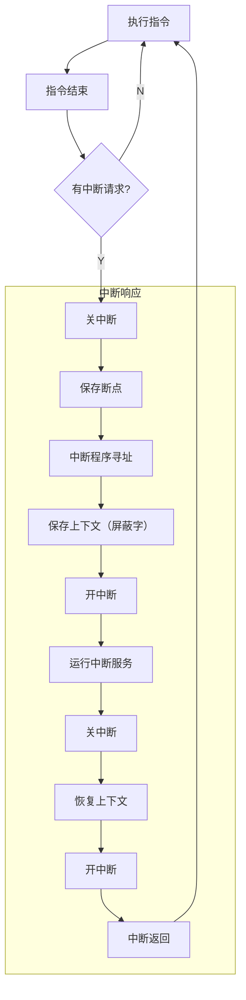
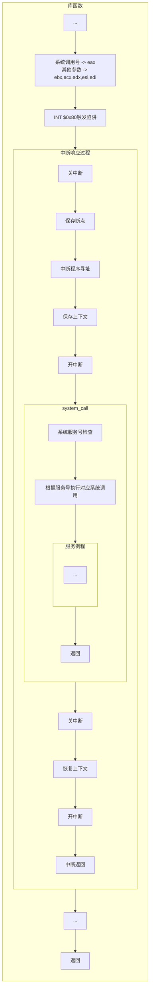

## 概念
虚拟机, 作为一层抽象屏蔽底层资源差异,  并暴路出一组接口供上层软件调用。

## 特征
并发并行 共享 虚拟 异步

## 目标与功能
管理（进程、线程调度，虚拟内存系统，硬件设备，文件管理）
接口（系统调用，命令行接口，图形接口）
扩充机器
封装

## 发展
手工操作阶段
批处理阶段
	单道批处理
	多道批处理
分时系统
实时系统
分布式
## CPU运行状态
内核态用户态
## 中断
作用 让内核强行夺取CPU控制权, 时CPU从用户态进入内核态
中断异常陷阱硬中断软中断内中断外中断 
中断 O中断 时钟中断
中断屏蔽中断判优
### 中断程序执行过程

### 系统调用执行过程

## 内核体系
宏内核 微内核 混合内核