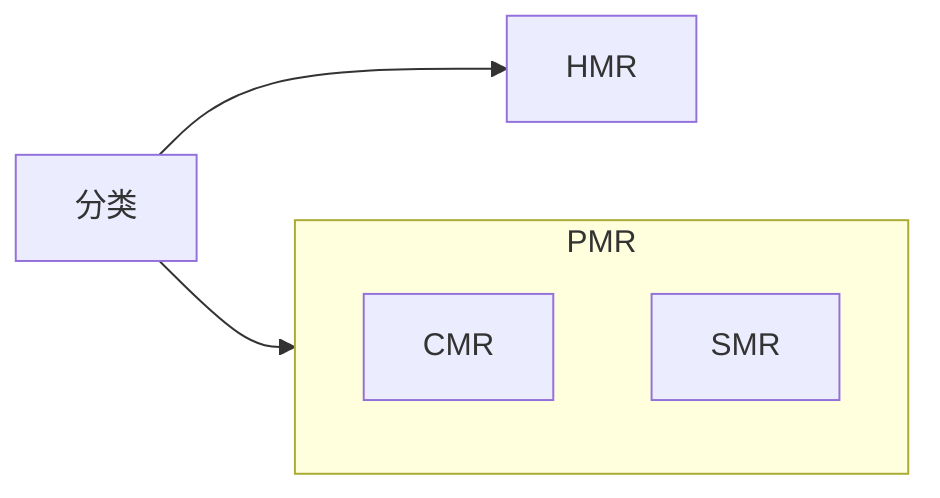

## 结构
磁盘 磁头 电机 磁头控制器 磁盘控制器 缓存...
## 概念
柱面 磁道 扇区
扇区：硬盘最小得读写单元
块/簇：多个扇区组合在一起为一个块，一般是$2^n$个扇区，是操作系统对硬盘读写最小单元
页：硬盘与内存之间操作的最小单元
## 分区
- MBR
- GPT
## 机械硬盘(顺序读写负载)存取时间
- $寻道时间 = 磁道数量*经过每个磁道所要的时间 + 启停时间$
- 旋转时间 $平均旋转时间 = 旋转半圈的时间$
- 传输时间
## 寻址方式
- CHS寻址 Cylinder(柱面)、Heads(磁头)、Sector(扇区) 柱面是径向的 磁头决定了是哪个盘片扇区决定了是在磁道的哪个位置 S从1开始编号
- LBA寻址 $LBA = (C*磁头数 + H)*扇区数  +(S-1)$
- 考虑到**ZBR(Zone Block Record)，采用等密度结构**，LBA的寻址此时是由硬盘控制器来实现的.
## 记录数据的方式

## raid
- 指标 可靠 容量 吞吐量（不同类型的工作负载 顺序/随机 读/写）
- raid0
- raid1
- raid4
- raid5
- 软raid
- 硬raid
## 常见指标
连续读写速度
随机读写速度
4k文件多线程读写速度
容量
转速 rpm
...
## 关联
- [[../../软件/linux下硬盘管理和文件系统|linux下硬盘管理和文件系统]]